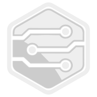

<h1 align="center">Relay</h1>

Relay: _verb_. To receive and pass on (information or a message).

Relay is a Discord Clone built with React and Redux. It is a real-time chat application that allows users to create channels, _**relay**_ messages, and upload files. It also features a live chat search function and a live user search function.
