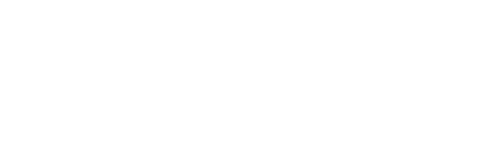

---

<h2>Work in Progress. For details, see below.</h2>

Relay is a Discord Clone built with React and Redux. It is a real-time chat application that allows users to create channels, _**relay**_ messages, and upload files. It also features a live chat search function and a live user search function.

<h2>Project Outline</h2>

(Screenshots will be posted as the project progresses.)

<h3>Project Design</h3>

-   [&check;] Create a name for the project: **Relay**.

 

-   [&check;] Create a logo using Canva/Figma.

 

-   [&check;] Color scheme: I will follow the color scheme of the Discord web application.
    -   [&check;] Inspect Discord web app for hex codes and font styles.

<h3>Frontend</h3>

-   [&check;] Create a React frontend using create-react-app.
-   [&check;] Style the sign in form to match the Discord sign in page, but with a different background.
-   [&check;] Ensure responsiveness to mobile layouts for sign in page.

-   [&check;] Research pop-out transition between sign in and sign up forms.
-   [&check;] Implement basic structure of the UI for main servers page.
-   [&check;] Clone profile card of Discord into Relay.
-   [&nbsp;&nbsp;&nbsp;] Learn the use of web sockets for real-time chat communication (socket.io library)

<h3>Backend/Authentication</h3>

-   [&check;] Create a Node.js backend.
-   [&check;] Leverage and implement Firebase Authentication for user authentication.
    -   [&check;] Use Redux State to manage user data.
    -   [&check;] Implement onAuthStateChanged to simplify codebase and to manage user sessions.
-   [&check;] Research, compare/contrast database options (PostgreSQL, MongoDB, AWS DynamoDB, Firebase). (Firebase chosen)
-   [&check;] Implement Firebase Firestore for storage of non-authentication user profile data.
